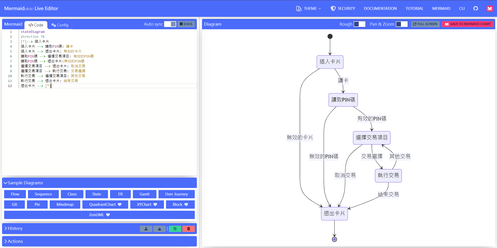

# 其他語法

### 文字上色方式


{{ read_csv(('table/extra.csv' ) ) }}  


!!! warning
    為使用雙框，此文檔不能使用斜體  


### 警告框

用法  

```

!!! warning
    為使用雙框，此文檔不能使用斜體

```

???+note
    以`???`開頭可以將區塊變成可折疊
    ```
    ??? note
        可折疊
    ```
    ??? note
        可折疊
    `???`+預設展開
    ```
    ???+ note
        預設展開
    ```
    ???+ note
        預設展開
!!! warning
    內文需要縮排
!!! abstract "增加標題方式"
    ```
    !!! abstract "增加標題方式"
    ```
    如果不想顯示標題可以使用空字串即可
    ```
    !!! abstract ""
        不要標題
    ```
    !!! abstract ""
        不要標題


??? info "其他提示框"
    !!! tip
    !!! success
    !!! question
    !!! warning
    !!! failure
    !!! danger
    !!! bug
    !!! example
    !!! quote


### 選項卡

```
=== "步驟一"
    -   內文一  
=== "步驟二"
    -   內文二
=== "注意事項 "
    -   內文需要縮排
=== "使用時機"
    -   如果有文件需要寫步驟可使用
```

**效果**

=== "步驟一"
    -   內文一  
=== "步驟二"
    -   內文二
=== "注意事項 "
    -   內文需要縮排
=== "使用時機"
    -   如果有文件需要寫步驟可使用    

---


### checkbox

```
- [ ] 集保admin
- [x] 集保主管
- [x] 集保經辦
- [ ] 集保理級
- [ ] 申請單位代號 admin 
- [ ] 申請單位代號主管
- [ ] 申請單位代號經辦

```    

- [ ] 集保admin
- [x] 集保主管
- [x] 集保經辦
- [ ] 集保理級
- [ ] 申請單位代號 admin 
- [ ] 申請單位代號主管
- [ ] 申請單位代號經辦


### Mermaid使用方式

使用[Mermaid Live Edit](https://mermaid.live/edit)編輯mermaid  



- **status mermaid**  


        ```mermaid
        stateDiagram
        direction TB
        [*]--> 插入卡片
        插入卡片 --> 讀取PIN碼: 讀卡
        插入卡片 --> 退出卡片: 無效的卡片
        讀取PIN碼 --> 選擇交易項目: 有效的PIN碼
        讀取PIN碼 --> 退出卡片:無效的PIN碼
        選擇交易項目 --> 退出卡片: 取消交易
        選擇交易項目 --> 執行交易: 交易選擇
        執行交易 --> 選擇交易項目: 其他交易
        執行交易 --> 退出卡片: 結束交易
        退出卡片 --> [*]
        ```  


```mermaid
stateDiagram
direction TB
[*]--> 插入卡片
插入卡片 --> 讀取PIN碼: 讀卡
插入卡片 --> 退出卡片: 無效的卡片
讀取PIN碼 --> 選擇交易項目: 有效的PIN碼
讀取PIN碼 --> 退出卡片:無效的PIN碼
選擇交易項目 --> 退出卡片: 取消交易
選擇交易項目 --> 執行交易: 交易選擇
執行交易 --> 選擇交易項目: 其他交易
執行交易 --> 退出卡片: 結束交易
退出卡片 --> [*]
```  


### 表格使用方式  

[表格使用方式參考](https://squidfunk.github.io/mkdocs-material/reference/data-tables/)

```md
| 姓名   | 年齡   | 職業  |
| :---- | :----: | ----: |
| 置左   | 置中   | 置右  |
| 張三   | 30    | 工程師 |
| 李四   | 25    | 設計師 |
| 王五   | 35    | 醫生   |

```

-   讀取excel表格

:   [excel表格參考](https://timvink.github.io/mkdocs-table-reader-plugin/)

**語法**:

`{{` read_csv('table/test.csv') `}}`  

---

{{ read_csv('table/test.csv') }}

`{{` read_csv(('table/test.csv' ) , colalign=("left","center","right")) `}}`

--- 
!!! info inline  "對齊方式" 
    colalign=("left","center","right")  
       
    {==有多個欄位想設定就填幾個==}  
      
    **不填寫預設文字靠左數字靠右**  


{{ read_csv(('table/test.csv' ) , colalign=("left","center","right")) }}

!!! warning inline 
    為了方便製作表格，使用CSV格式。存檔時選擇{==CSV UTF-8(逗號分隔)==} 若不選擇此格式會亂碼

  


-   **在表格內要換行有兩種方式**

=== "使用 `<br>` "

    -   使用br  

    {{ read_csv('table/6-1-1查詢區之條件說明.csv') }}  

=== "在excel格子內換行"

    -   使用alt+enter(在excel格子內換行)

    {{ read_csv('table/6-1-1-2查詢區之條件說明.csv') }}  


---


!!! info "使用與不使用差別"
    **使用< br>標籤時在MD顯示會較為清楚，但在excel撰寫時可能會導致易讀性較差<br>
    在excel格子內換行的話撰寫易讀性較高，但在MD顯示會較不清楚。**


### 待討論議題Icon:material-chat-question:{ .question}

在想要放置icon的地方使用`:material-chat-question:{ .question}`
```
像這樣:material-chat-question:{ .question}
```
像這樣:material-chat-question:{ .question}


